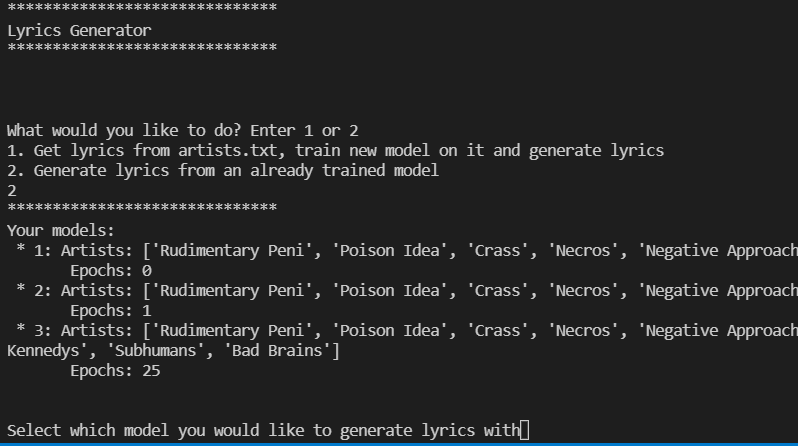
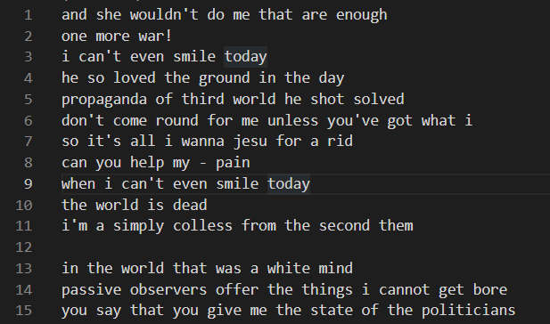

# Lyrics Generator

Lyrics Generator was a quick and fun project inspired by [this](https://towardsdatascience.com/ai-generates-taylor-swifts-song-lyrics-6fd92a03ef7e) article. It uses the [LyricsGenius](https://github.com/johnwmillr/LyricsGenius) library to scrape song lyrics of inputted artists off of Genius. It then stores the dataset so that it can be reused and makes use of the [textgenrnn](https://github.com/minimaxir/textgenrnn) library to generate lyrics with an neural network. While the can sometimes be nonsensical, it's still fun to play around with and could be improved by tinkering with the settings and giving it a larger dataset. 

# How to use
After installing all the required libraries, visit the [Genius API Client management page](https://genius.com/api-clients) to create an API client. Then paste the access token into the config.yml file. Then, populate the artists.txt file with as many artists which can be found on Genius as you'd like. I wrote this project with Python 3.8.7 with Keras version 2.3.0 and tensorflow version 2.3.2.  

I'd love to see any song lyrics this program is able to generate for you!

The result of my trying to have it write angry punk lyrics